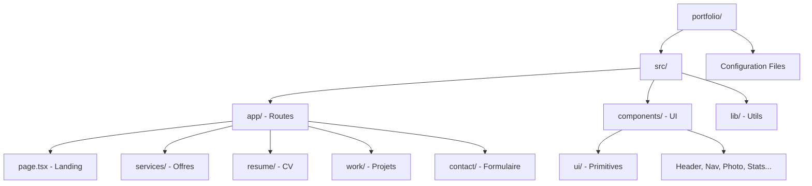

# Rapport d'Analyse du Projet : Portfolio Next

Ce document présente une analyse détaillée du projet de portfolio, incluant son architecture technique, ses composants clés et ses fonctionnalités.

## 🛠️ Stack Technique

Le projet utilise les technologies les plus modernes de l'écosystème React :

- **Framework** : [Next.js 16 (App Router)](https://nextjs.org) - Utilisation intensive du routing basé sur le système de fichiers et des composants client/serveur.
- **Bibliothèque UI** : [React 19](https://react.dev)
- **Styling** : [Tailwind CSS 4](https://tailwindcss.com) - Approche "Utility-first" pour un design rapide et cohérent.
- **Animations** : [Framer Motion](https://www.framer.com/motion/) - Utilisé pour les transitions de pages et les interactions fluides.
- **Typographie** : JetBrains Mono (Via Google Fonts).
- **Icônes** : Lucide React et React Icons (Font Awesome, Bootstrap Icons, Simple Icons).
- **Composants UI** : Radix UI (Primitives pour des composants accessibles comme Select, Tabs, Tooltip).
- **Gestion de Formulaires** : React Hook Form (avec intégration Nodemailer pour le backend).
- **Autres** : 
  - `Swiper` pour les carrousels de projets.
  - `react-countup` pour les animations de statistiques.
  - `nodemailer` pour la gestion des emails de contact.

## 📁 Structure du Projet

## 🚀 Fonctionnalités Clés

1.  **Page d'Accueil Dynamique** : Salutations automatiques ("Bonjour" / "Bonsoir") basées sur l'heure locale.
2.  **Présentation des Services** : Modales détaillées (`ServiceModal`) expliquant chaque domaine d'expertise.
3.  **Portfolio de Projets** : Slider interactif avec Swiper, incluant une vue détaillée des stacks techniques et des liens vers les démos/GitHub.
4.  **CV Interactif** : Système d'onglets pour naviguer entre Expérience, Formation, Compétences et À propos.
5.  **Formulaire de Contact** : Validation côté client et envoi d'emails via une route API intégrée (`/api/contact`).
6.  **Transitions Fluides** : Effet de transition d'escalier (`StairTransition`) entre les pages pour une expérience premium.

## 🔍 Points d'Attention / Observations

- **Modularité** : Le code est très modulaire, avec une séparation claire entre les primitives UI et les composants métiers.
- **Performance** : Utilisation de Next.js Font pour une optimisation automatique des polices.
- **Responsive** : Le design est entièrement adaptatif (Mobile-first avec des points de rupture XL pour les écrans larges).
- **Qualité du Code** : Utilisation de TypeScript pour une robustesse accrue.

> [!TIP]
> Le projet est déjà très bien structuré. Pour les futures évolutions, l'ajout d'une base de données (ex: MongoDB ou PostgreSQL via Prisma) pour gérer les projets dynamiquement pourrait être envisagé.
